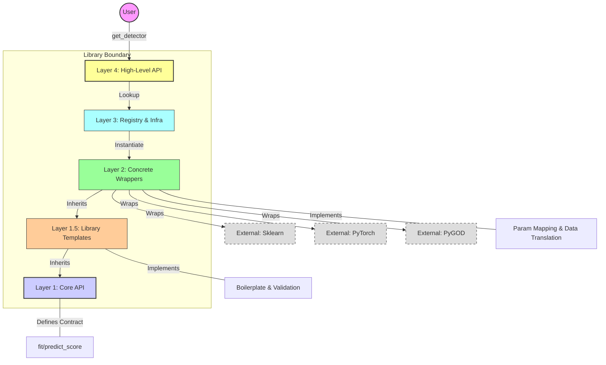
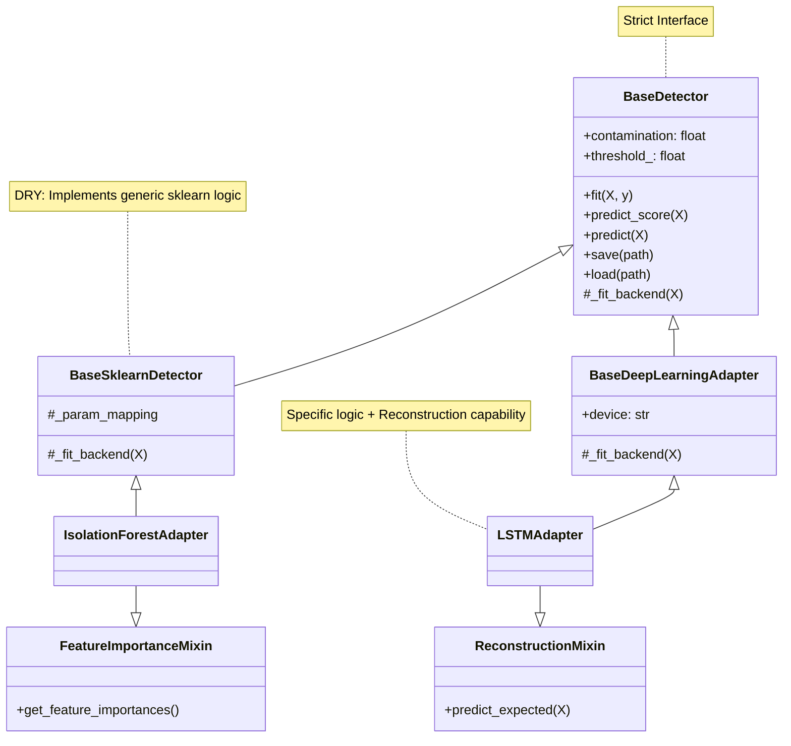
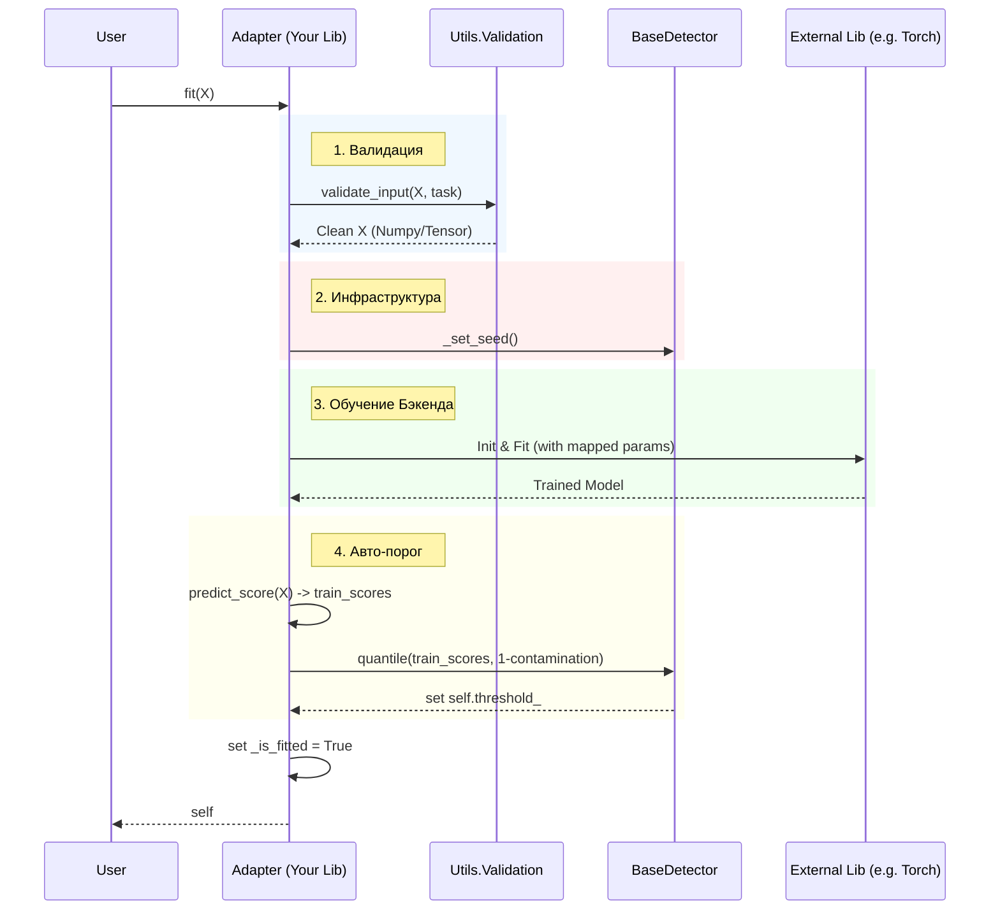

# OmniAD

## High-Level Architecture
Purpose: To show the user how the library is structured globally—from its call to the core.
Meaning: To show layer isolation. The user only touches the Facade, while the Core is isolated from external libraries.

## Class Hierarchy
Purpose: For developers adding new algorithms.
Meaning: To show who to inherit from and how Mixins work.

## Data Flow: The fit() Method
Purpose: To explain what happens “under the hood” when a user calls fit.
Meaning: To show centralized validation, threshold calculation, and backend operations.

## Storage Structure (ZIP Container)
Purpose: To explain to administrators and engineers what a .zip model file is.
Meaning: To show that the heavy model and metadata are stored separately.

