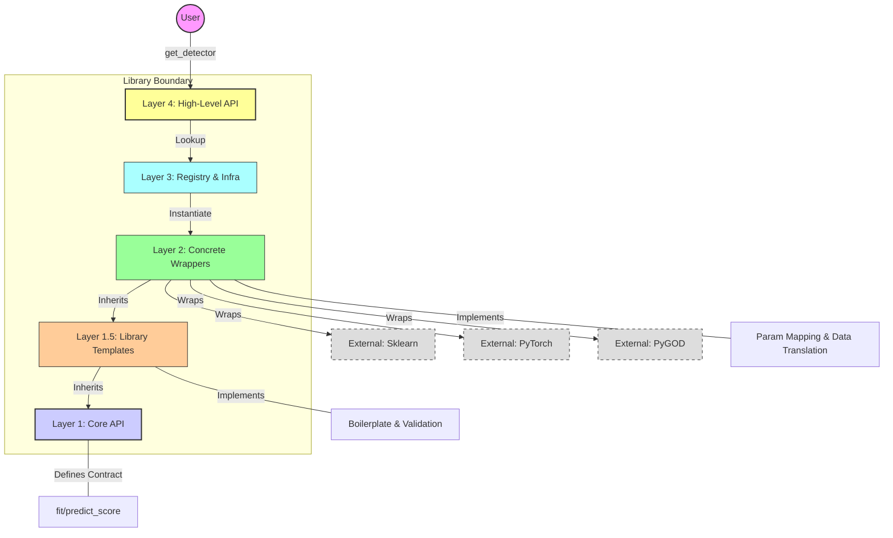

# OmniAD

## High-Level Architecture
Purpose: To show the user how the library is structured globally—from its call to the core.
Meaning: To show layer isolation. The user only touches the Facade, while the Core is isolated from external libraries.

